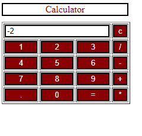
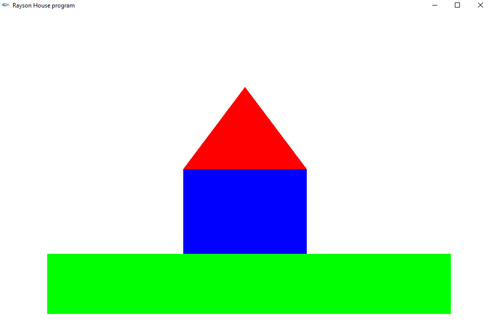
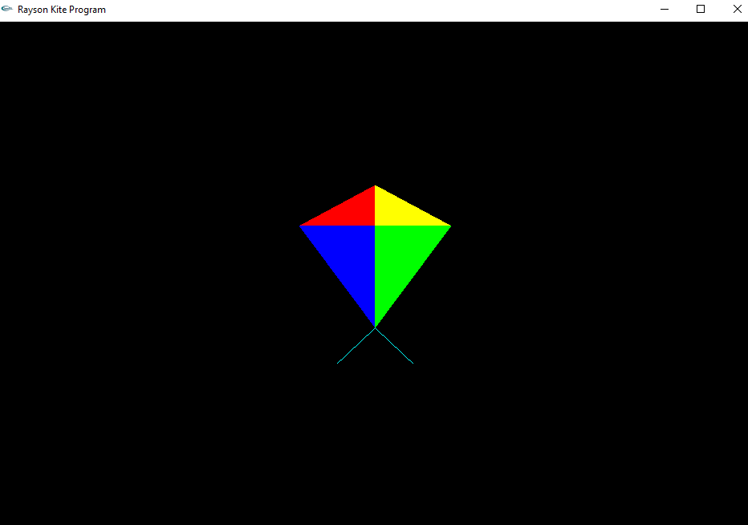

# Simple-Programs
## 1) Calci.html
# Requirements
Notepad
# Details
Calculator application developed using html and javascript
#Screenshots

## 2) Line.cpp
# Requirements
OpenGL
Codeblocks

# Details
Drawing a line using opengl plugin on codeblocks
#Screenshots

## 3) House.cpp
# Requirements
OpenGL
Codeblocks

# Details
Building a house using opengl and codeblocks  with colors
#Screenshots

